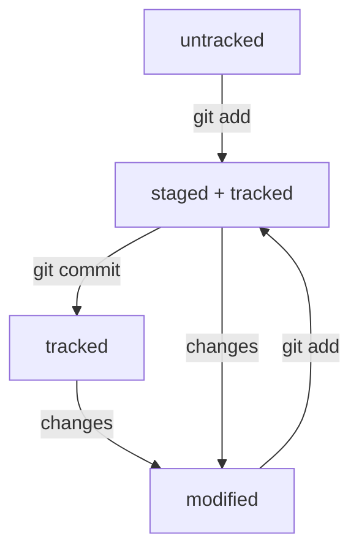

## *Проект* помощник для начала работы с Git

### Создание локального респозитория


1. Для начала нам естественно нужен Git на нашем устройстве. Для этого скачиваем его по этой ссылке [Git](https://git-scm.com/download/win) (_Для Windows_).
2. Далее нам переходим в консоль Git Bush и открываем директорию где хотим создать свой респозиторий с помощью команды.
```
cd <путь>
```
3. В открытой директории создаем новую папку, которая будет служить корнем для нашего респозитория с помощью команды.
```
mkdir <имя папки>
```
4. По-умолчанию мы окажемся в созданной нами папкой, далее производим инициализацию нашего респозитория командой.
```
git init
```
5. После успешной инициализации создаем, в нашем случае, файл README.md командой.
```
touch README.md
```
6. Далее выполняем первый коммит
```
git add README.md && git commit README.md - m "Создан файл README для проекта помощника Git"
```


Таким образом мы создали локальный респозиторий. Для пуша его на GitHub для начала необходимо выполнить следующие действия


### Синхронизация с GitHub


Создаем ключ шифрования


1. Переходим в домашнюю директорию.
```
cd ~
```

2. Генерируем ключ
```
ssh-keygen -t ed25519 -C "Эл.почта, к которой приявзан GitHub"
```
или
```
ssh-keygen -t rsa -b 4096 -C "Эл.почта, к которой приявзан GitHub"
```
3. Далее указываем место хранения ключа и устанавливаем кодовую фразу (~если нужно~).
4. Для привязки к GitHub копируем публичный ключ.
```
clip ~/.ssh/id_ed25519.pub
```
или
```
clip ~/.ssh/id_rsa.pub
```
5. В настройках аккаунта на GitHub устанавливаем SSH ключ.
6. Проверяем правильность ключа командой
```
ssh -T git@github.com
```
и подтвержаем подлиность сервера введя yes.


### Связываем локальный и удаленный респозиторий


1. На новом созданном респозитории на GitHub копируем ссылку ssh типа на наш респозиторий.
2. В консоли прописываем команду.
```
git remote add origin <скопированная ссылка на респозиторий>
```
3. Далее пушим наш проект.
```
git push -u origin master
```


### Что такое Хэш?


Хэш (hash) - это строка, которая состоит из цифр 0-9 и латинских букв A-F. Хэш в гите присваивается каждому коммиту и является основным индетификатором коммита.
Зная хэш коммита можно узнать следующую информацию о нем: автора и дату коммита и содержимое закоммиченных файлов. Данная информация преобразуется гитом с помощью алгоритма SHA-1.
Перечень всех коммитов можно получить с помощью команды:


### Что такое лог?


Лог это журнал записей всех коммитов. Вызываеться он следующей командой:

```bash
git log
```


В полученном списке записей мы можем увидить хэш каждого коммита, автора, дату и сообщения коммита.


Для быстрого поиска коммитов удобно использовать сокращенный лог, в котором будут указаны только сокращенный хеш и сообщение коммита


```bash
git log --oneline
```


### Что такое HEAD?


HEAD - это служебный файл, который указывает на последний коммит.
если перейти в папку .git нашего проекта и прочитать файл HEAD мы обнаружим ссылку на последний коммит. Прочитав данную ссылку мы получим хэш последнего коммита.


```bash
$ cd .git && cat HEAD
ref: refs/heads/master

$ cat refs/heads/master
4e3f4d67d1abaf5b11459390d8454790a99f1c84
```


### Статусы файлов в Git


Статусы необходимы для отслеживания изменений файлов в респозитории. Каждому файлу присваивается какой-либо статус. 

1. ***untracked*** (неотслеживаемый). Это новые файлы в респозитории. Git видит, что такие файлы существуют, но не следит за их изменениями. У таких файлов нет предыдущих версий, зафиксированных в коммитах или командой git add;
2. ***staged*** (подготовленный). Это те файлы, которые попали в staging area после выполнения команды git add, то есть файлы которые войдут в коммит;
3. ***tracked*** (отслеживаемый). Это файлы которые отслеживаются Git, то есть которые уже были зафиксированны gir commit или которые были добавлены в staging area командой git add;
4. ***modified*** (измененный). К данным файлам относятся те, которые были изменены после начала отслеживания Git.





Чтение статусов фалов производится с помощью команды:


```bash
git status
```


